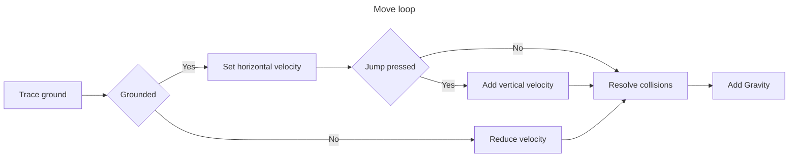

# Competitive Controller
A good starting point for creating your own competitive character controller in Unity is needed primarily for online games, where you cannot rely on the rigidbody, and the PhysX character controller hides too much logic.

You can see example [heare](https://github.com/aleksandrpp/CompetitiveMan)

`v1.0.0`
 

https://github.com/aleksandrpp/CompetitiveController